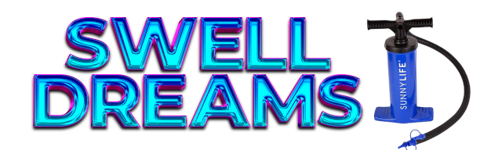

<p align="center">
  
</p>
<h3 align="center">SwellDreams v6.5.1 — Stable Overhaul</h3>
<p align="center">
  <a href="https://discord.gg/WZTzMevrQ9">Join the community on Discord</a>
</p>

> ## ⚠️ Stuck on v6.0 / "can't update" / "tell me who you are"?
> Older installs can't auto-update past v6.0 (a tracked-file + history issue). **One-time fix:**
> 1. Download **[repair.bat](https://raw.githubusercontent.com/Airegasm/SwellDreams/release/repair.bat)** — right-click the page → **Save As** → save it **into your SwellDreams folder** (next to `start.bat`). *(Linux/Mac: use [repair.sh](https://raw.githubusercontent.com/Airegasm/SwellDreams/release/repair.sh).)*
> 2. **Double-click `repair.bat`.** It updates you to the latest and launches.
>
> Your settings, characters, and personas are **safe** — they aren't touched. After this one time, updates work normally again. *(No git checkout? Re-download fresh and copy your old `backend/data` folder in.)*

> **Disclaimer**: SwellDreams is provided as-is for entertainment and creative purposes only. The developers assume no responsibility or liability for any misuse, negligence, injury, damage, or loss arising from the use of this software or any connected hardware. Users assume all risk and responsibility for their own safety and conduct. By using this software, you agree to these terms.

# SwellDreams

**v6.5.1 "Stable Overhaul"**

> **Safety Notice**: The Emergency Stop button in this software should NOT be relied upon as your primary safety mechanism. Always have a hardware disconnect within arm's reach during use.

---

## What is SwellDreams?

SwellDreams is a self-hosted, AI-powered roleplay platform that connects an LLM-driven chat to real-world smart devices. The AI doesn't just talk — based on what's happening in the scene, it can drive smart outlets on your local network, track capacity in real time, and steer the story through a deep, author-controlled scripting layer.

Think of it as an AI game master that *does things*.

> **No LLM or smart devices required.** They unlock the full experience, but neither is mandatory. You can author every greeting, response, and story beat by hand, and everything runs as pure story-mode without hardware. Start with what you have and add integrations when you're ready.

---

## Character Cards

Everything revolves around the **unified SwellD character card** — one card type that scales from a single character to a multi-character group to an instructor, all in one editor.

- **Single / Group / Instructor in one card.** Add or remove members on the base card to turn a solo character into a group on the fly. Each member carries its own description, personality, gender, voice examples, and attributes; the AI writes for the contextually relevant members each turn.
- **Instructor mode.** A leaner persona that drops the roleplay flourish and acts as a direct, "straight to business" inflation partner/guide.
- **Per-card Author's Note.** Each card carries its own steering note (no longer one global blob), seeded from a sensible default on new cards.
- **Stories & versions.** Each card holds multiple stories, each with its own versioned greetings and scenarios (with LLM-enhance and random-version options), example dialogues, attributes, and checkpoints. Snapshot whole-card versions to experiment safely.
- **Redesigned Checkpoint system.** Author instructions and story events fire across capacity ranges to steer the AI's behavior as intensity climbs — your main tool for custom scenario control and pacing. In a group, the Base character governs by default; hand the wheel to any member with the **Primary** picker.
- **Pumpable characters.** Make a character an inflation target with its own capacity gauge, staged portraits, burst threshold, and full AI awareness (knowledge level, desire to be inflated/popped).
- **Custom Buttons & Button Sets.** Quick-action buttons (send message, device control, run a trigger set/tree); swap whole **Button Sets** on the fly, with per-member message targeting in group mode.
- **Import.** Bring in members from other SwellD cards, or import **Tavern V2/V3** cards (PNG/JSON) — lorebooks and world info convert into the Dictionary/Library.

Built-in cards include **Luna**, **Mistress Scarlett**, **Vex**, **Dr. Iris Chen**, the **Research Team Alpha** group, and **Lana** — a Lana + Scarlett hybrid that shows the unified group format end to end.

---

## The Trigger System (replaces Flows)

Scenario scripting is done with **Triggers** — the modern, no-code automation layer that replaces the old Flow engine.

- **Trigger Sets** — named, reusable bundles of actions you can fire from a button, a checkpoint, or the API.
- **Trigger Trees** — a visual nested-block builder for branching, conditional, capacity-driven sequences.
- **Actions** — send AI/player/system messages, control devices (on / off / timed / cycle / pulse), set variables (`[Flow:name]`), adjust capacity and state, run minigames, and route on their results.
- **Minigames editor** — build interactive games (wheel, dice, coin flip, RPS, number guess, slot machine, card draw, memory, reflex, timer) whose outcomes branch the story via trigger gotos.

> The legacy Flow editor still exists for reference but is deprecated and hidden by default. New scenarios should use Triggers.

---

## Lorebook: Dictionary & Library

Real lorebook support, split into two layers:

- **Dictionary** — global, always-on (or keyword-triggered) world/term definitions, shared across cards. Ships with an **Inflation Tools** group (ticked on new cards by default).
- **Library** — per-card lore entries, constant or keyword-triggered. Tavern character-book / world-info imports land here.

---

## Personas

- Define your player identity: name, pronouns, appearance, personality, and inflation dispositions.
- **Persona checkpoints** for how you react to your own and the character's inflation at each capacity range.
- **Staged portraits** that transition with capacity, and built-in personas (Marcus, Zara).
- The **`[Gender]` smart pronoun** resolves he/she/they correctly by grammatical position.

---

## Sessions & State

- **Persistent per-character chats.** Every character remembers its most-recent conversation (saved after every message — crash/close safe). Switch characters freely without losing anything; **New** wipes the current one. An optional *"Use" Begins New Chat Session* toggle starts fresh on selection instead.
- **Capacity gauge** (0–100%) with live auto-tracking from pump runtime, manual adjust, and auto-shutoff.
- **Pain scale** and a selectable **emotion** display.
- **Variables** — `[Player]`, `[Char]`, `[Gender]`, `[Capacity]`, `[CharCapacity]`, plus custom `[Flow:name]` state.

---

## LLM Backends

Point SwellDreams at any local or cloud LLM:

- **Local** — llama.cpp or KoboldCpp on your network (chat template auto-detected).
- **OpenRouter** / any **OpenAI-compatible** endpoint.
- **AI Horde** — the free, community-run inference grid ([aihorde.net](https://aihorde.net)). No hardware or paid key required; leave the key blank for the anonymous tier or add one for priority. Works out of the box via a built-in default profile.

Streaming responses, guided impersonation, guided/again responses, and LLM-enhanced authoring are all supported. The main prompt construction was rebuilt for cleaner, more reliable behavior.

### Chat Templates

| Template | Format | Models |
|----------|--------|--------|
| **ChatML** | `<\|im_start\|>` / `<\|im_end\|>` | Qwen, Yi, many fine-tunes |
| **Llama 2** | `[INST]` / `<<SYS>>` | Llama 2 Instruct |
| **Llama 3** | `<\|start_header_id\|>` | Llama 3 / 3.1 / 3.2 / 3.3 Instruct |
| **Mistral** | `[INST]` (v0.2+) | Mistral, Mixtral |
| **Mistral v7 (Tekken)** | `[SYSTEM_PROMPT]` / `[INST]` | Mistral Small 3.x, Skyfall & finetunes |
| **Gemma 2 / 3** | `<start_of_turn>` / `<end_of_turn>` | Gemma 2 / 3 Instruct |
| **Alpaca / Vicuna** | `### Instruction` / `USER`–`ASSISTANT` | Alpaca / Vicuna fine-tunes |
| **Jinja** | Server-side | llama.cpp applies its own template |
| **None** | Raw concatenation | No wrapping applied |

### Sampler Settings

A full sampler panel: Temperature, Top-K/P, Typical-P, Min-P, Top-A, TFS, Top N-Sigma; repetition/frequency/presence penalties; DRY, XTC, quadratic smoothing, dynamic temperature, Mirostat 1/2; stop sequences, banned tokens/strings, `logit_bias`, GBNF grammar, custom sampler order; ban-EOS, BOS, fixed seed, `n_keep`; per-profile "override server samplers"; lock/neutralize; and per-connection presets.

---

## Smart Device Control

Smart outlets become interactive session hardware — controlled manually, by Triggers, or autonomously by the AI, all with safety limits and live capacity tracking.

- **Manual** — one-tap on/off in the session.
- **Triggers** — device actions fired by messages, checkpoints, timers, capacity thresholds, or buttons.
- **AI-driven** — the AI embeds `[pump on]` / `[pump off]` (and pulse/timed/cycle) tags in its replies, governed by per-pump limits. An optional **Pump Trigger Phrase Assist** scans narration for pump phrases to help weaker models that forget the tag.

| Mode | Behavior |
|------|----------|
| **On/Off** | Direct toggle with optional auto-off timer |
| **Timed** | Run for N seconds, then auto-stop |
| **Cycling** | Configurable on-duration / off-interval / repeat count |
| **Pulse** | Rapid 0.5-second bursts |

### Automatic Pumps & Calibration

Calibrating an outlet creates a named **Automatic Pump** — calibration and device-control limits live **with the pump, not the outlet**, and the pump remembers the device/IP it was last plugged into. The primary pump's limits act as the upper ceiling. Once calibrated, **Auto-Capacity** tracks capacity live from pump runtime with auto-shutoff. There's also a **Manual pump** mode (bulb/bike) for non-smart setups.

### Supported Outlets

> **⚠️ Cloud outlets are being phased out** in favor of local-network outlets — cloud APIs change often, rapid cycling risks rate-limiting/bans, and every command costs an internet round-trip.

**Local-network (recommended — no account, no cloud, no rate limits):**

| Outlet | Connection | Notes |
|--------|-----------|-------|
| **KAUF** | ESPHome (local HTTP) | ✅ Main recommendation — local, no account, no flashing. [kaufha.com/plf12](https://kaufha.com/plf12/) |
| **Shelly** | Local HTTP API | No account/cloud. ⚠️ Often out of stock. [us.shelly.com](https://us.shelly.com/collections/smart-plugs) |
| **Athom** | Tasmota / ESPHome | Pre-flashed local plugs. ⚠️ Ships from Shenzhen (slow). [tindie.com/stores/athom](https://www.tindie.com/stores/athom/) |
| **TP-Link Kasa (Legacy)** | Native local TCP | Older Kasa (e.g. HS103). ⚠️ Disable firmware auto-update — 1.1.x+ removes the local protocol. |

**Other integrations:**

| Brand | Connection | Status |
|-------|-----------|--------|
| **Home Assistant** | REST API (local) | Supported — bridges Tapo and any HA switch entity |
| **TP-Link Tapo** | Python bridge | Out of service — KLAP encryption blocks third-party control (use Home Assistant) |
| **Govee / Tuya (Smart Life)** | Cloud API | Supported but being phased out |
| **Simulated** | None | Built-in testing mode, no hardware required |

---

## Media & Skins

- **Media album** — upload/tag images, video, audio; embed inline with `[Image:tag]`, `[Video:tag]`, `[Audio:tag]` (loop/blocking/silent modes).
- **Skins** — full visual theming with saveable profiles and 8 built-in scene skins. Per-character (per-story) skins auto-load on session start, and checkpoints can swap skins by capacity range. Skinning applies across chat, settings, modals, and device cards.

---

## Interface, Access & Data

- **Desktop** three-column layout (persona · chat · character) and a **mobile** single-column layout with swipeable drawers.
- **Remote access** over your LAN or Tailscale, with an **IP whitelist**.
- **Simulation mode** — full functionality without hardware.
- **API key encryption** — AES-256-GCM with a machine-bound key.
- **Per-file character storage**, auto-indexed on startup.
- **Auto-updating** — the start scripts pull the latest `release` and rebuild before launching.

---

## Installation

### Requirements

- **Node.js** 18+
- **Python** 3.8+ (optional — only for the TP-Link Tapo bridge)
- A modern web browser

### Get it

```bash
git clone -b release https://github.com/Airegasm/SwellDreams.git
cd SwellDreams
```

### Run

```batch
start.bat        :: Windows
```
```bash
chmod +x start.sh && ./start.sh   # Linux / macOS
```

The start script auto-updates, installs dependencies, builds the frontend, starts the server on **port 8889**, and opens `http://localhost:8889`. After the first clone it's **auto-updating** — just run it again to update.

### Stopping

```batch
stop.bat         :: Windows
./stop.sh        # Linux / macOS
```

---

## Support

- **Issues**: [GitHub Issues](https://github.com/Airegasm/SwellDreams/issues)
- **Discord**: [Join the community](https://discord.gg/WZTzMevrQ9)
- **Web**: [airegasm.com](https://airegasm.com)

## License

Stable Overhaul — All rights reserved.

---

Made with care by the Airegasm team.
